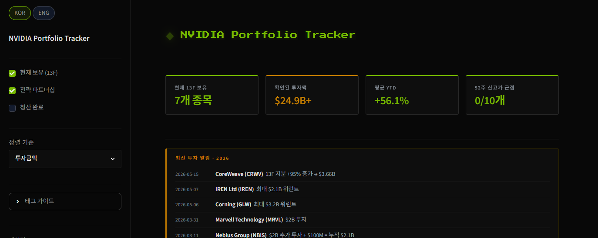

# NVIDIA Portfolio Tracker

A Streamlit dashboard that tracks the public companies NVIDIA holds, based on its SEC 13F filings, and prices them with real-time quotes. Each position shows its YTD return, sector, and how the stake changed quarter to quarter.

English | [한국어](#nvidia-portfolio-tracker-한국어)


**Live at:** https://nvidiascreener.streamlit.app

## Demo



## Features

- **13F-based portfolio** - companies NVIDIA holds, tagged by badge (new / core / partner / exited), with a hover thesis on why NVIDIA invested and how the deal was structured.
- **Real-time quotes** - Finnhub live prices sit on top of a daily fundamentals snapshot. A `LIVE` / `CLOSED` badge shows market state, and it falls back to previous close if there's no key.
- **Performance & sectors** - YTD return charted against NVDA and the SOXX semiconductor ETF, plus sector-allocation pie charts.
- **13F filing history** - a per-quarter timeline of position changes (new / added / reduced / exited), with dates normalized to SEC filing schedules.
- **News & alerts** - an investment-news feed, with Telegram automation for 13F filings, deal news, and macro-risk thresholds.
- **Bilingual & responsive** - Korean / English toggle, a mobile layout, and a visitor badge showing concurrent sessions and cumulative users.

## How it works

Market data runs on two layers so quotes stay fresh without tripping rate limits.

- **Fast layer (real-time):** Finnhub's `/quote` endpoint supplies live price, day change, and YTD for US tickers, cached in-app for 90 seconds. It's key-authenticated, so shared-IP limits don't apply.
- **Slow layer (daily snapshot):** a GitHub Actions job runs `scripts/fetch_market_data.py` once a day and commits `data/market_data.json` - 1-year price history, market cap, P/E, 52-week range, FANUC (Tokyo), and USD/JPY. The app reads that file instead of calling Yahoo directly.

Filing data (dates, share counts, stakes) comes from SEC 13F filings, cross-checked against structured aggregators. SEC blocks cloud IPs, so the 13F monitor runs locally through n8n; news and snapshot monitors run on GitHub Actions.

## Tech Stack

- **App & charts** - Streamlit, Plotly
- **Data** - pandas, yfinance (daily snapshot), Finnhub API (real-time)
- **Automation** - GitHub Actions (snapshot, news, macro), n8n (SEC 13F monitor), Telegram Bot
- **Analytics** - Google Analytics 4 (Data API for the cumulative-users badge)
- **Deploy** - Streamlit Community Cloud

## Getting Started

### Environment variables

Create `.streamlit/secrets.toml`. Only `FINNHUB_API_KEY` is needed to run the app; everything else is optional.

| Key | Description |
| --- | --- |
| `FINNHUB_API_KEY` | Real-time US quotes. Omit it and the app falls back to a previous-close snapshot. |
| `GA4_PROPERTY_ID` + `[gcp_service_account]` | Powers the cumulative-users badge via the GA4 Data API. Optional. |
| `[admin] password` | Gates the feedback viewer. Optional. |
| `[telegram] bot_token`, `chat_id` | Telegram alerts for feedback and monitors. Optional. |

> Top-level keys like `FINNHUB_API_KEY` need to sit **above** any `[section]` header in the TOML file - put one below a section and it gets nested into it instead.

### Install and run

```bash
pip install -r requirements.txt
streamlit run app.py
```

To refresh the market snapshot locally (GitHub Actions normally handles this):

```bash
python scripts/fetch_market_data.py
```

## Deployment

Runs on Streamlit Community Cloud and auto-deploys from `main`. A scheduled GitHub Actions workflow (`market_snapshot.yml`) commits the daily market snapshot. Secrets are set in the Streamlit Cloud dashboard, not committed to the repo.

Source is public for portfolio purposes. Not investment advice.

* * *

# NVIDIA Portfolio Tracker (한국어)

엔비디아가 SEC 13F로 공시한 보유 종목을 실시간 시세와 함께 보여주는 Streamlit 대시보드입니다. 종목마다 YTD 수익률, 섹터, 분기별 지분 변동을 볼 수 있어요.

[English](#nvidia-portfolio-tracker) | 한국어


**배포 주소:** https://nvidiascreener.streamlit.app

## 데모


## 주요 기능

- **13F 기반 포트폴리오** - 엔비디아가 보유한 기업을 배지(신규 / 코어 / 파트너 / 청산)로 분류하고, 호버하면 투자 이유와 딜 구조를 보여줍니다.
- **실시간 시세** - 일일 펀더멘털 스냅샷 위에 Finnhub 실시간 가격을 얹었습니다. `LIVE` / `CLOSED` 배지로 장 상태를 표시하고, 키가 없으면 전일 종가로 대체합니다.
- **성과·섹터 분석** - NVDA, SOXX(반도체 ETF)와 비교한 YTD 수익률 차트와 섹터별 배분 파이 차트.
- **13F 공시 히스토리** - 분기별 지분 변동(신규 / 증가 / 감소 / 청산)을 SEC 제출 일정에 맞춰 정리한 타임라인.
- **뉴스·알림** - 투자 뉴스 피드와, 13F 공시·딜 뉴스·매크로 위험 임계값에 대한 텔레그램 알림.
- **한/영·반응형** - 한국어/영어 토글, 모바일 레이아웃, 동시 접속자와 누적 사용자를 보여주는 방문자 배지.

## 어떻게 동작하나요

시세 데이터는 rate limit에 걸리지 않으면서 신선하게 유지하려고 두 개 레이어로 나눠 받아옵니다.

- **빠른 레이어(실시간)**: Finnhub `/quote`가 US 종목의 현재가, 일간 등락, YTD를 90초 캐시로 제공합니다. 키 인증 방식이라 공유 IP 제한과는 무관해요.
- **느린 레이어(일일 스냅샷)**: GitHub Actions가 하루 한 번 `scripts/fetch_market_data.py`를 돌려 `data/market_data.json`을 커밋합니다. 1년 종가 히스토리, 시총, PER, 52주 범위, FANUC(도쿄), USD/JPY가 여기 담기고, 앱은 Yahoo를 직접 부르지 않고 이 파일을 읽습니다.

공시 데이터(날짜, 주식수, 지분율)는 SEC 13F 공시에서 가져와 구조화 애그리게이터와 대조합니다. SEC가 클라우드 IP를 막아버려서 13F 모니터는 로컬 n8n에서 돌고, 뉴스와 스냅샷 모니터는 GitHub Actions에서 돕니다.

## 기술 스택

- **앱·차트** - Streamlit, Plotly
- **데이터** - pandas, yfinance(일일 스냅샷), Finnhub API(실시간)
- **자동화** - GitHub Actions(스냅샷·뉴스·매크로), n8n(SEC 13F 모니터), 텔레그램 봇
- **분석** - Google Analytics 4(누적 사용자 배지용 Data API)
- **배포** - Streamlit Community Cloud

## 시작하기

### 환경 변수

`.streamlit/secrets.toml`을 만드세요. 실행에 꼭 필요한 건 `FINNHUB_API_KEY` 하나고, 나머지는 없어도 돌아갑니다.

| 키 | 설명 |
| --- | --- |
| `FINNHUB_API_KEY` | US 실시간 시세용. 없으면 전일 종가 스냅샷으로 대체됩니다. |
| `GA4_PROPERTY_ID` + `[gcp_service_account]` | GA4 Data API로 누적 사용자 배지를 채웁니다. 선택. |
| `[admin] password` | 피드백 열람 화면을 잠급니다. 선택. |
| `[telegram] bot_token`, `chat_id` | 피드백·모니터용 텔레그램 알림. 선택. |

> `FINNHUB_API_KEY` 같은 최상위 키는 `[section]` 헤더보다 **위**에 있어야 합니다. 아래 두면 그 섹션 안으로 들어가버려요.

### 설치·실행

```bash
pip install -r requirements.txt
streamlit run app.py
```

시장 스냅샷을 로컬에서 직접 갱신하려면(평소엔 GitHub Actions가 알아서 합니다):

```bash
python scripts/fetch_market_data.py
```

## 배포

Streamlit Community Cloud에서 돌아가고 `main` 브랜치에서 자동 배포됩니다. 일일 시장 스냅샷은 예약된 GitHub Actions 워크플로(`market_snapshot.yml`)가 커밋하고, 시크릿은 레포에 커밋하지 않고 Streamlit Cloud 대시보드에서 설정합니다.

포트폴리오 목적의 공개 소스입니다. 투자 조언이 아닙니다.
